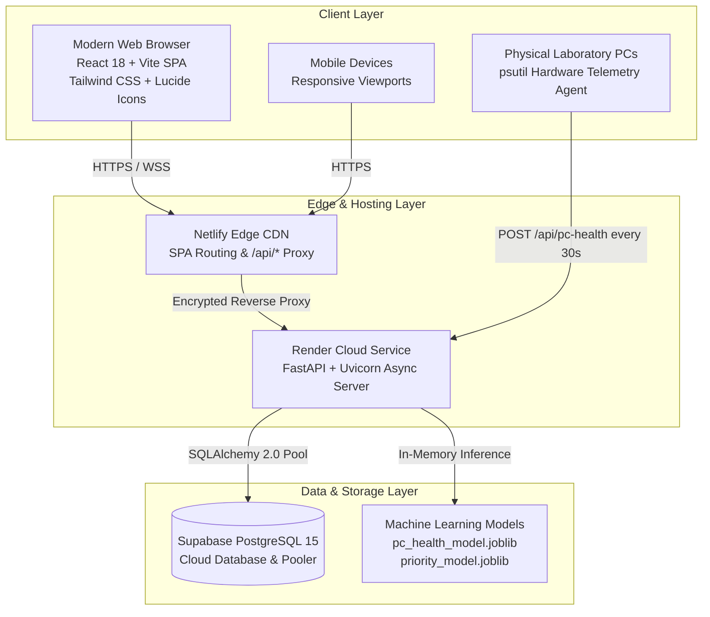
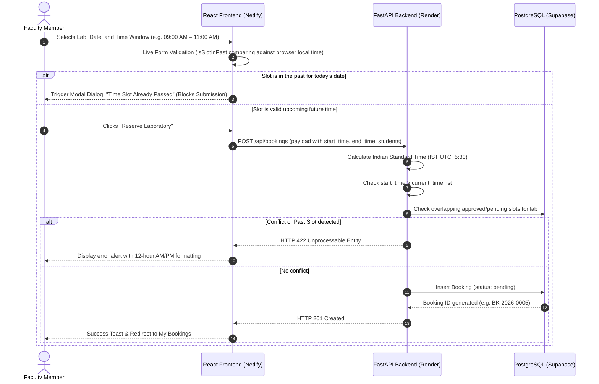
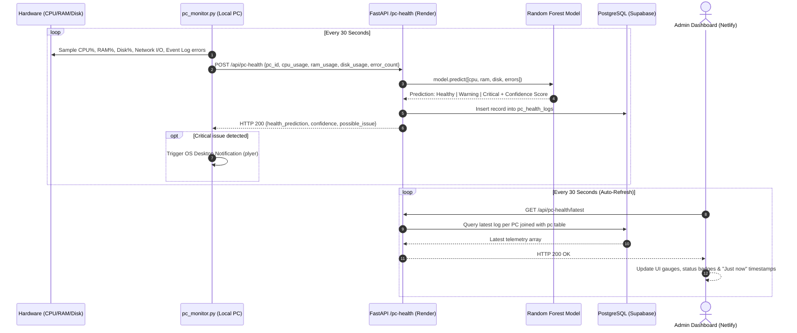
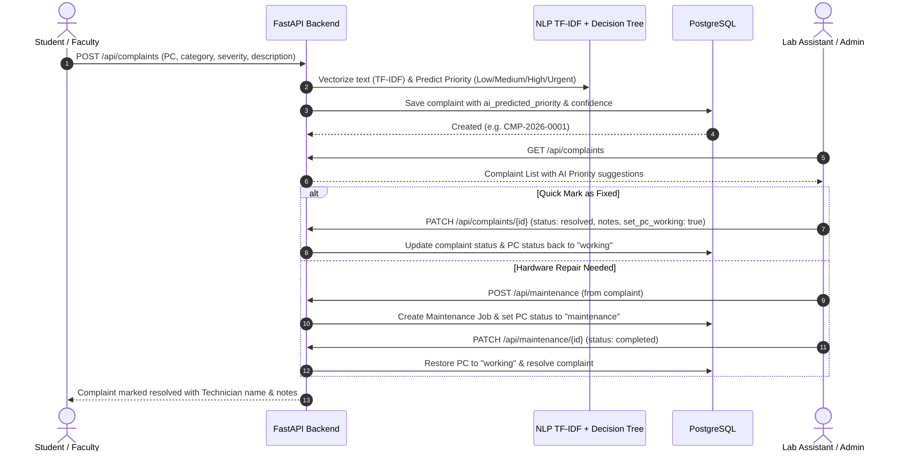
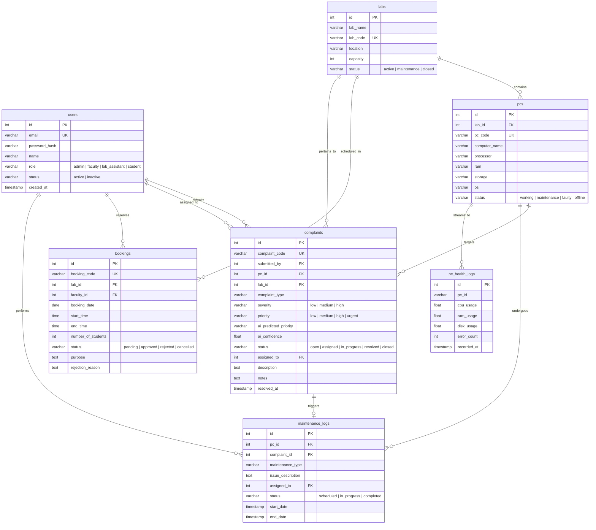

# AI-Based Smart Computer Laboratory Management and Asset Monitoring System
## Comprehensive Final Project Documentation & Technical Architecture Guide

---

## 📌 Executive Summary

Modern higher education and technical institutions face substantial logistical friction in managing computer laboratories:
- **Uncoordinated Scheduling**: Double-bookings, manual paper registers, and slot booking conflicts.
- **Untracked Hardware Health**: Workstations fail silently during practical exams or classes; staff are unaware until students complain.
- **Manual Maintenance & Disconnected Support**: Complaints are reported informally without diagnostic telemetry or SLA tracking.
- **Inefficient Lab Utilization**: Laboratories sit idle or are overcrowded without analytics on seat-to-PC efficiency.

The **AI-Based Smart Computer Laboratory Management and Asset Monitoring System** is an enterprise-grade, full-stack, modular solution engineered with **FastAPI**, **React 18**, **PostgreSQL (Supabase)**, and embedded **Scikit-Learn Machine Learning models**. The system unifies asset tracking, laboratory reservations, support ticketing, preventive maintenance scheduling, real-time hardware telemetry streaming, and automated AI diagnostics into a single dashboard.

---

## 🏗️ 1. High-Level System Architecture



### Hosting Architecture & Live Endpoints

| Component | Technology | Live URL / Environment |
|---|---|---|
| **Frontend Application** | React 18, Vite, Tailwind CSS | [https://smartlab-management-system.netlify.app](https://smartlab-management-system.netlify.app) |
| **Backend REST API** | FastAPI, Python 3.11+, Uvicorn | [https://smartlab-management-system.onrender.com](https://smartlab-management-system.onrender.com) |
| **Database** | PostgreSQL 15 via Supabase | Hosted on Supabase Cloud (Southeast Asia / Singapore) |
| **PC Telemetry Agent** | Python `psutil`, `requests` | Background service on physical workstations |
| **Interactive API Docs** | OpenAPI (Swagger UI) | `https://smartlab-management-system.onrender.com/docs` |

---

## 🔄 2. Core End-to-End Workflows

### 2.1 Laboratory Reservation Workflow with Past-Slot Validation



### 2.2 Live Hardware Telemetry & Random Forest AI Health Workflow



### 2.3 Complaint Resolution & Preventive Maintenance Lifecycle



---

## 🤖 3. Machine Learning Architectures

### 3.1 Workstation Predictive Health (Random Forest Classifier)
- **Objective**: Continuously classify workstation operational state into `Healthy`, `Warning`, or `Critical` before total hardware crash.
- **Model Architecture**:
  - Algorithm: **Random Forest Classifier** (`n_estimators=100`, `max_depth=10`, `random_state=42`).
  - Input Features:
    1. `cpu_usage`: Continuous float (0.0% – 100.0%)
    2. `ram_usage`: Continuous float (0.0% – 100.0%)
    3. `disk_usage`: Continuous float (0.0% – 100.0%)
    4. `error_count`: Discrete integer (Windows Event Log error records)
  - Diagnostic Output: Predicted health label, prediction confidence score, and root-cause breakdown (e.g., *"High memory usage; High disk utilization"*).

### 3.2 Complaint Priority & Triage AI (TF-IDF + Decision Tree)
- **Objective**: Prevent critical lab equipment breakdown from getting lost in backlog by automatically analyzing natural language issue descriptions.
- **Pipeline Architecture**:
  1. **Preprocessing & Vectorization**: `TfidfVectorizer` (N-grams 1-2, sublinear TF scaling, English stopwords removal).
  2. **Feature Fusion**: Sparse TF-IDF matrix concatenated with one-hot encoded issue category and numeric severity.
  3. **Classification**: `DecisionTreeClassifier` trained on laboratory incident logs.
  4. **Explainability**: Outputs the decision path and top split features so lab staff understand why a priority was suggested. Staff retain full override capability.

### 3.3 Lab Utilization Clustering
- **Objective**: Evaluate lab efficiency by comparing booked hours, actual student count, PC usage, and laboratory seating capacity.
- **Metrics Tracked**:
  - Capacity Utilization Rate: $\text{Students} / \text{Lab Capacity} \times 100$
  - Workstation Occupancy: $\text{PCs Used} / \text{Students} \times 100$
  - Classification: `Under-utilized` (< 40%), `Optimal` (40%–85%), `Over-utilized` (> 85%).

---

## 👥 4. Role-Based Access Control (RBAC) Matrix

| Feature / Action | Admin | Lab Assistant | Faculty | Student |
|---|:---:|:---:|:---:|:---:|
| **Lab Management (CRUD)** | Full | Read-only | Read-only | Read-only |
| **PC Asset Tracking (CRUD)** | Full | Full | Read-only | Read-only |
| **Inventory & Peripherals** | Full | Full | Read-only | Read-only |
| **User Directory Management** | Full | Read-only | No access | No access |
| **Reserve Laboratory (Booking)** | Full | Full | Full | Read-only |
| **Approve / Reject Bookings** | Full | Full | No access | No access |
| **Submit Complaint Ticket** | Full | Full | Full | Full |
| **Triage & Assign Complaints** | Full | Full | No access | No access |
| **Resolve & Fix Complaints** | Full | Full (Assigned) | No access | No access |
| **Schedule PC Maintenance** | Full | Full | No access | No access |
| **AI Workstation Health Monitoring**| Full | Full | Read-only | No access |
| **AI Lab Utilization Analytics** | Full | Full | Read-only | No access |
| **Reports & Audit Export** | Full | Full | Summary | No access |

---

## 🗄️ 5. Database Schema & Data Dictionary

The production database is hosted on **PostgreSQL 15** via Supabase.



---

## 🚀 6. Step-by-Step Run & Deployment Guide

### 6.1 Running in Cloud Production (Zero Local Setup)
The application is pre-deployed and live 24/7 on high-availability cloud infrastructure:
1. Open the Web Application: **[https://smartlab-management-system.netlify.app](https://smartlab-management-system.netlify.app)**
2. Log in using any role credentials below:
   - **Admin**: `admin@lab.edu` / `admin123`
   - **Faculty**: `faculty@lab.edu` / `faculty123`
   - **Lab Assistant**: `assistant@lab.edu` / `assistant123`
   - **Student**: `student@lab.edu` / `student123`
3. Backend API Documentation: **[https://smartlab-management-system.onrender.com/docs](https://smartlab-management-system.onrender.com/docs)**

---

### 6.2 Running Locally for Development

#### Prerequisites
- Python 3.10+ (ensure `python` is added to PATH)
- Node.js 18+ and `npm`

#### Step 1: Clone and Set Up Backend
```powershell
# Navigate to backend directory
cd backend

# Install Python requirements
pip install -r requirements.txt

# Start FastAPI Uvicorn Server
python -m uvicorn app.main:app --reload --port 8000
```
- Local API Docs: `http://localhost:8000/docs`
- Health check: `http://localhost:8000/api/health`

#### Step 2: Start Frontend
```powershell
# In a separate terminal, navigate to frontend directory
cd frontend

# Install node dependencies
npm install

# Start Vite dev server
npm run dev
```
- Open browser at: `http://localhost:5173`

#### Quick 1-Click Batch Launchers (Windows)
The root workspace includes convenience batch scripts:
- `start_all.bat`: Launches both Backend and Frontend in separate windows.
- `run_backend.bat`: Launches FastAPI backend.
- `run_frontend.bat`: Launches Vite frontend.
- `run_tests.bat`: Runs the automated Python test suite.

---

### 6.3 Deploying Telemetry Agent on Laboratory PCs

Each physical laboratory workstation runs the standalone Python telemetry agent:

```powershell
# 1. Install lightweight dependencies
pip install psutil requests

# 2. Start the telemetry agent for the PC
python monitoring\pc_monitor.py --pc-id CLA-PC-001 --server https://smartlab-management-system.onrender.com --interval 30
```

#### Creating 1-Click Agent Launchers for PCs
Create a `.bat` file (e.g. `run_pc_monitor.bat`) on the target machine:
```bat
@echo off
title SmartLab Workstation Telemetry Agent
cd /d "%~dp0"
python monitoring\pc_monitor.py --pc-id CLA-PC-001 --server https://smartlab-management-system.onrender.com --interval 30
pause
```
*Tip: Place a shortcut to this `.bat` in Windows Startup (`shell:startup`) to run telemetry automatically when the PC powers on!*

---

## 🧪 7. Quality Assurance & Automated Testing

### 7.1 Backend Integration Test Suites
```powershell
# Phase 1: Authentication & RBAC Foundation (5 tests)
python backend/test_phase1.py

# Phase 2: Labs, PCs, Inventory, Users (17 tests)
python backend/test_phase2.py

# Phase 3: Complaints, AI Triage, Maintenance (20 tests)
python backend/test_phase3.py
```

### 7.2 Playwright Automated End-to-End (E2E) Browser Tests
The frontend includes comprehensive Playwright tests supporting desktop, laptop, tablet, and mobile viewports:

```powershell
cd frontend

# Run responsive modal & close button verification suite
npx playwright test e2e/responsive.spec.js --project=chrome-desktop

# Run across all viewports
npx playwright test e2e/responsive.spec.js
```

**Verified Test Scenarios**:
- ✅ Modal bounds enforcement: Header with `✕` close button strictly bounded inside viewport (`y >= 0 and y <= viewportHeight`).
- ✅ Sticky footer: Bottom `Close` button strictly visible inside viewport.
- ✅ Multi-modal dismissal: Closes via `✕` click, footer `Close` click, backdrop overlay click, and `Escape` keypress.
- ✅ Mobile responsiveness: Clean stacking on 375×667 mobile screens without horizontal document overflow.
- ✅ Past-slot booking protection: Live UI modal triggers when selecting past times for today.

---

## 🛡️ 8. Security & Reliability Highlights

1. **Password Security**: Strong cryptographic hashing via `bcrypt` (12 rounds) with individual salts.
2. **Stateless JWT Authentication**: HMAC-SHA256 tokens with role claims verified at FastAPI dependency level.
3. **Database Concurrency Protection**: Lab reservations employ `with db.begin_nested()` transactional isolation and overlapping time window range checks to prevent race condition double-bookings.
4. **Timezone Awareness**: Strict Indian Standard Time (`IST = timezone(timedelta(hours=5, minutes=30))`) evaluation prevents UTC cloud server drift from allowing expired slot bookings.
5. **CORS & Environment Isolation**: Configured CORS origins with environment variable abstraction via `pydantic-settings`.

---

## 📜 9. Team & Maintenance

- **Developer**: Vimal Raj M V
- **Repository**: [GitHub Repository](https://github.com/Vimal-raj-2004/SmartLab-Management-System-)
- **Live Deployment**: [SmartLab Management System](https://smartlab-management-system.netlify.app)
- **License**: MIT Academic License
